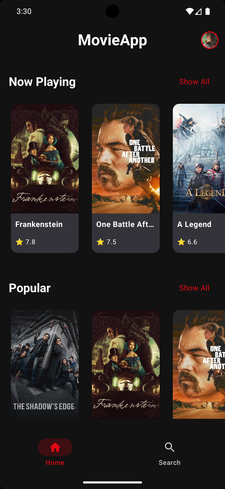
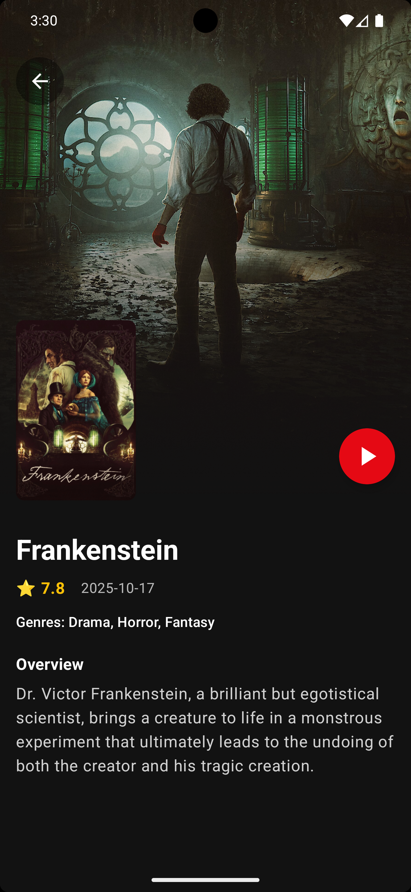
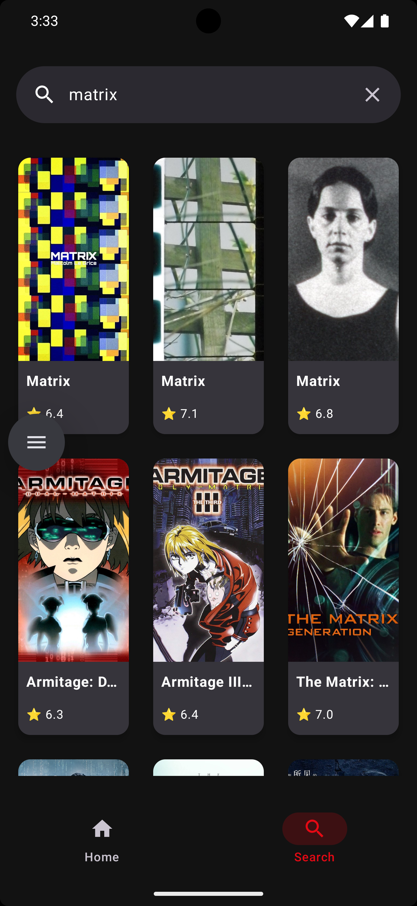
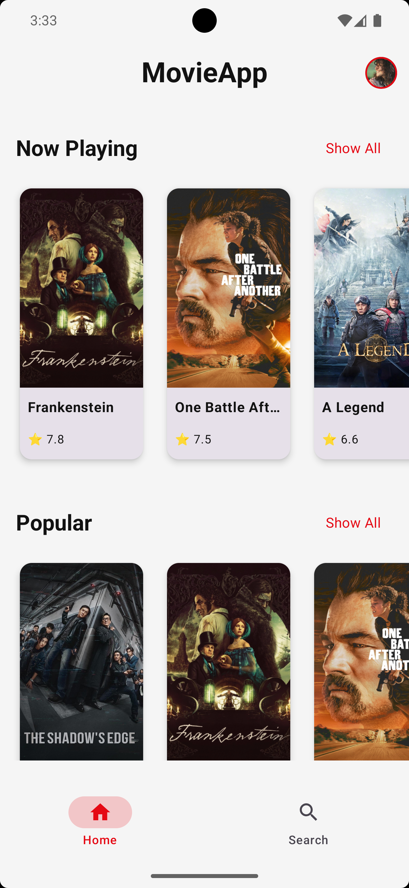
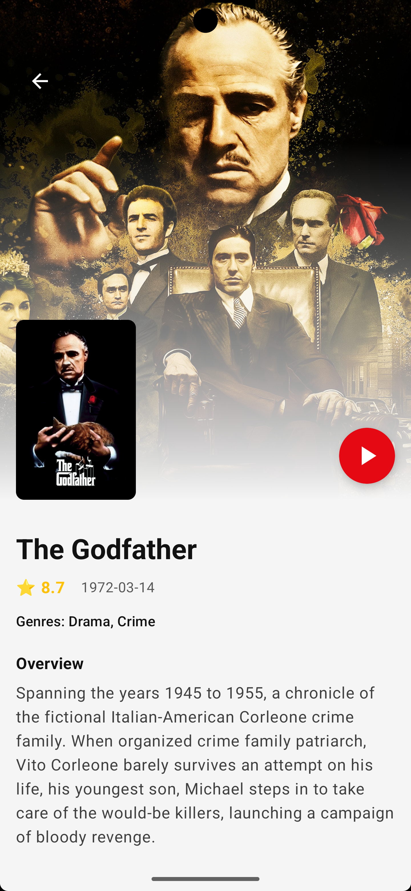
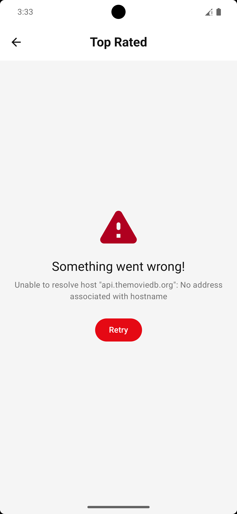

## **1. 🎬 Introduction  (Proje İsmi ve Kısa Özet)**

* MovieApp is a modern, native Android application designed to provide an immersive movie discovery experience, powered by the TMDB API.
* Built entirely with Kotlin and Jetpack Compose, the project strictly adheres to MVVM architecture and Clean Code principles to ensure scalability and testability.
* Beyond standard listing features, it incorporates advanced capabilities such as Infinite Scrolling (Pagination), real-time search with debounce logic, and a robust error-handling system.
* The UI is crafted with Material 3 standards, supporting dynamic Dark/Light themes and Edge-to-Edge design for a premium user experience.

---

## **2. 📱 Screenshots & Demo (Ekran Görüntüleri ve Demo)**

|                       Home Screen                      |                       Detail Screen                      |                      Search Screen                      |
| :----------------------------------------------------: | :------------------------------------------------------: | :-----------------------------------------------------: |
|   |   |  |
|                    Home Screen Light                   |                    Detail Screen Light                   |                    Error Screen Light                   |
|                          :---:                         |                           :---:                          |                          :---:                          |
|  |  |  |

---

## ✨ **Key Features 🇬🇧**

* 🎬 **Infinite Scrolling (Pagination)**
* 🔍 **Smart Search & History** (Debounce + SharedPreferences)
* 📱 **Immersive Detail View**
* 🌗 **Dynamic Dark/Light Theme**
* ⚠️ **Robust Error Handling (Retry Button)**
* 🌍 **Localization (English + Turkish)**
* ✨ **Modern UI/UX (Material 3, Edge-to-Edge)**
* 📌 **Bottom Navigation**

---

## ✨ **Temel Özellikler 🇹🇷**

* 🎬 **Sonsuz Kaydırma (Pagination)**
* 🔍 **Akıllı Arama ve Geçmiş**
* 📱 **Kapsamlı Detay Ekranı**
* 🌗 **Karanlık/Aydınlık Mod**
* ⚠️ **Hata Yönetimi (Tekrar Dene Butonu)**
* 🌍 **İngilizce & Türkçe Dil Desteği**
* ✨ **Modern Arayüz (Material 3)**
* 📌 **Alt Menü Navigasyonu**

---

## 🛠 **Tech Stack & Libraries 🇬🇧**

* **Language:** Kotlin
* **UI:** Jetpack Compose (Material 3)
* **Architecture:** MVVM + Repository Pattern
* **Networking:** Retrofit + Gson
* **Async:** Coroutines, Flow
* **Images:** Coil
* **Navigation:** Navigation Compose
* **Local Storage:** SharedPreferences
* **Testing:** JUnit 4, MockK, Coroutines Test

---

## 🛠 **Teknoloji Yığını ve Kütüphaneler 🇹🇷**

* **Programlama Dili:** Kotlin
* **UI:** Jetpack Compose (Material 3)
* **Mimari:** MVVM + Repository Pattern
* **Network:** Retrofit + Gson
* **Async:** Coroutines + Flow
* **Resim:** Coil
* **Navigasyon:** Navigation Compose
* **Yerel Veri:** SharedPreferences
* **Test:** JUnit 4, MockK, Coroutines Test

---

## 🏗 **Architecture & Design Decisions 🇬🇧**

### **1. MVVM Architecture**

* State management via `StateFlow`
* Lifecycle-aware ViewModels

### **2. Manual Dependency Injection**

* Constructor Injection used instead of Hilt

### **3. Pagination Logic**

* Custom scroll listener
* Page number tracked inside ViewModel

---

## 🏗 **Mimari ve Tasarım Kararları 🇹🇷**

### **1. MVVM Mimarisi**

* `StateFlow` ile state yönetimi
* Yaşam döngüsünü bilen ViewModel yapısı

### **2. Manuel Dependency Injection**

* Hilt yerine Constructor Injection kullanıldı

### **3. Sayfalama Mantığı**

* Özel scroll listener
* Sayfa numarası ViewModel içinde tutulur

---

## 🛣️ **Development Roadmap & Workflow 🇬🇧**

1. API Key secured via `local.properties`
2. Directory structure planned
3. Models, Repository, Serialization implemented
4. Integration tests written before UI
5. Theme & localization prepared
6. UI built from components to full screens
7. Unit tests (Search & Home) implemented
8. Error screens added (Retry mechanism)

---

## 🛣️ **Geliştirme Yol Haritası 🇹🇷**

1. API anahtarı `local.properties` içine güvenli şekilde eklendi
2. Klasör yapısı planlandı
3. Modeller, Repository ve Serialization işlemleri tamamlandı
4. UI’dan önce entegrasyon testleri yazıldı
5. Tema ve lokalizasyon hazırlandı
6. UI bileşenlerden tam ekranlara doğru oluşturuldu
7. Unit testler (Search & Home) yazıldı
8. Hata ekranları (Retry mekanizması) eklendi

---

## 🤖 **AI Usage Philosophy 🇬🇧**

* AI used for assistance and boilerplate generation
* All implemented code was reviewed and fully understood
* No blind copy–paste

---

## 🤖 **Yapay Zeka Kullanım Felsefesi 🇹🇷**

* AI yardım amaçlı ve boilerplate azaltmak için kullanıldı
* Tüm kodlar anlaşılmış ve gözden geçirilmiş şekilde projeye dahil edildi
* Körü körüne kopyala–yapıştır yapılmadı

---

## 🧪 **Testing Strategy 🇬🇧**

### **1. Unit Tests**

* JUnit 4, MockK, Coroutines Test
* Tested ViewModels (state transitions, debounce, pagination)

### **2. Integration Tests**

* `MovieRepositoryTest` — API connectivity & parsing
* `MovieFeaturesTest` — Pagination & Search validation

---

## 🧪 **Test Stratejisi 🇹🇷**

### **1. Birim Testleri**

* JUnit 4, MockK, Coroutines Test
* ViewModel testleri (state geçişleri, debounce, pagination)

### **2. Entegrasyon Testleri**

* `MovieRepositoryTest` — API bağlantısı ve JSON çözümleme testi
* `MovieFeaturesTest` — Sayfalama ve Arama doğrulama testi

---

